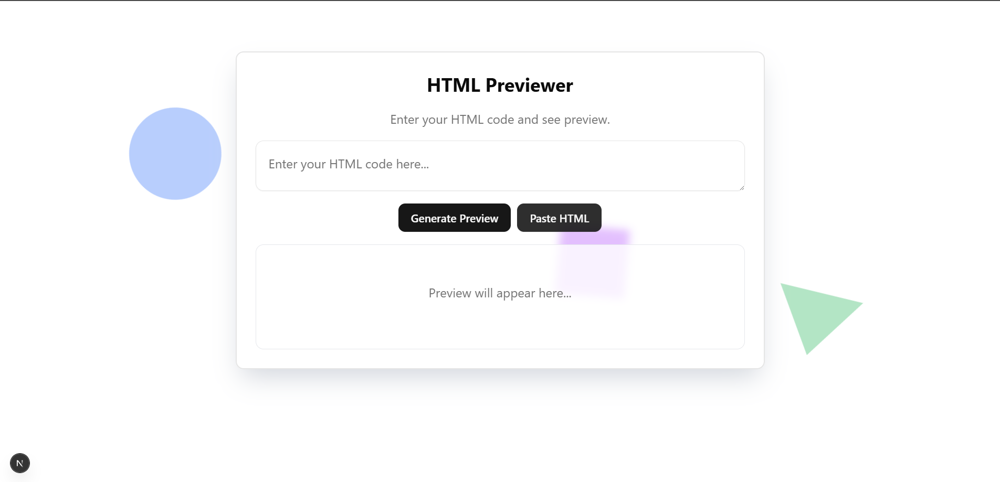

# HTML Previewer

A modern, responsive HTML code previewer built with Next.js and GSAP animations. This application allows users to write HTML code and see the preview in real-time, featuring a beautiful animated background and a clean, user-friendly interface.

## Features

- 🎨 Real-time HTML preview
- 🌓 Dark/Light mode support
- 🎭 Animated background with GSAP
- 📱 Fully responsive design
- 🌟 Modern UI with glass-morphism effects
- ✍️ Clean HTML editor with line numbers
- 🔒 Secure HTML sanitization
- 📋 Built-in error validation
- 📝 Sample HTML templates

## Screenshots




## Getting Started

First, run the development server:

```bash
npm run dev
# or
yarn dev
# or
pnpm dev
# or
bun dev
```

Open [http://localhost:3000](http://localhost:3000) with your browser to see the result.

## Technologies Used

- Next.js 16
- React 19
- GSAP (GreenSock Animation Platform)
- Tailwind CSS
- Shadcn/ui Components
- TypeScript
- DOMPurify (for HTML sanitization)

## Usage

1. Write your HTML code in the editor
2. See the preview update in real-time in the preview panel
3. Use "Load Sample" to load a predefined template
4. Use "Clear All" to clear the editor
5. Use "Copy HTML" to copy your code to clipboard
6. The preview updates automatically as you type

## Responsive Design

The application is fully responsive and works well on:
- 📱 Mobile devices (320px and up)
- 📱 Tablets (768px and up)
- 💻 Desktops (1024px and up)

## Animation Features

The background features three animated shapes:
- A floating circle with blue tint
- A rotating square with purple tint
- A morphing triangle with green tint

All shapes move independently with GSAP animations for a dynamic, engaging user experience.

## Security

The application uses DOMPurify to sanitize HTML input and prevent XSS attacks, ensuring safe preview of user-generated content.

## Project Structure

```
13_html_previewer/
├── app/
│   ├── globals.css
│   ├── layout.tsx
│   └── page.tsx
├── components/
│   ├── html-previewer.tsx    # Main component
│   ├── Predefined_Html.ts    # HTML templates
│   ├── ThemeToggle.tsx      # Dark/Light mode toggle
│   ├── error-boundary.tsx   # Error handling
│   ├── template-search.tsx  # Template search functionality
│   ├── ui/                  # UI components
│   └── lib/                 # Utility functions
└── public/                  # Static assets
```

## Contributing

Contributions are welcome! Please feel free to submit a Pull Request.

## License

MIT License

## Contact

Made by **Osama bin Adnan**
